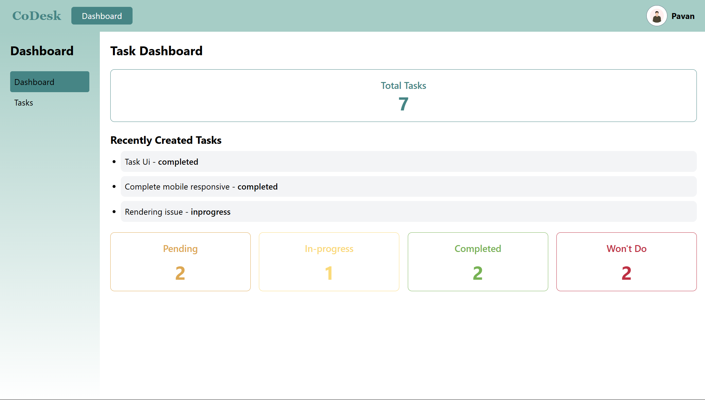

Here’s a well-structured `README.md` for your **CoDesk** task management project:  

---

# CoDesk - Task Management Application

CoDesk is a **modern task management application** that allows users to **create, update, and delete tasks** efficiently. It provides a seamless experience with **authentication, prioritization, and status tracking** for tasks. 

The application is built using the **MERN stack** with TypeScript and styled using **Tailwind CSS**, ensuring a **responsive and visually appealing UI**.

---

## 🚀 Features  

### ✅ Task Management  
- Create new tasks with **title, description, priority, and status**.  
- Update tasks dynamically.  
- Delete tasks when they are no longer needed.  

### 🔒 Authentication & Security  
- **Secure login & signup system** with authentication.  
- JWT-based authentication for enhanced security.  

### 🎨 UI & Responsiveness  
- Fully **responsive design** for mobile, tablet, and desktop views.  
- Clean and modern UI built with **Tailwind CSS**.  

### 📡 Deployment  
- **Frontend** hosted on [Vercel](https://vercel.com).  
- **Backend** hosted on [Render](https://render.com).  

---

## 🛠️ Tech Stack  

| Technology | Description |
|------------|-------------|
| **Frontend** | React with TypeScript, Tailwind CSS |
| **Backend** | Node.js with TypeScript, Express.js |
| **Database** | MongoDB |
| **Authentication** | JWT (JSON Web Token) |
| **Hosting** | Frontend - Vercel, Backend - Render |

---

## 📷 Screenshots  

### 💻 Desktop View  

### Home Page

### Dashboard Overview 

### Tasks Dashboard

### 📱 Mobile View  

  
  
  

---

Thank you for Checking 🚀